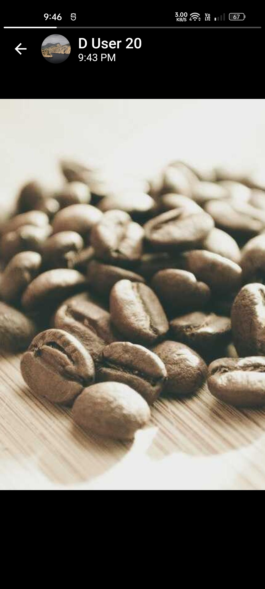

# WhatsApp

A WhatsApp UI clone in flutter (work in progress).

A working [web demo ↗️][weblink]

## Platforms

- Mobile
- Desktop
- [Web][weblink]

## Features

- Chats
  - Recent chats list (home screen)
  - Chat room screen
  - User profile screen (with animated user dp)
  - Sent message (with automatic reply)
  - Message status (pending, delivered, read,..)
  - Chat search bar
- New chat list
- Status
  - Status list
  - Recent and viewed updates
  - Status screen (with animated progress bar)
  - Status screen navigation (with tap and swipe gestures)
- Settings
  - Settings screen
  - Profile settings screen
  - Theme settings (with light and dark mode)

## Packages & APIs

- [flutter_bloc](https://pub.dev/packages/flutter_bloc)
- [window_size](https://github.com/google/flutter-desktop-embedding/tree/main/plugins/window_size)
- [visibility_detector](https://pub.dev/packages/visibility_detector)
- [picsum.photos](https://picsum.photos)

[weblink]: https://albinpk.github.io/flutter-clones

## Screenshots

- ### Android

  

    
    
    
    
    
    
    
    
    
    
    
    
    
    
    
    
    
    
    
    
    
  

